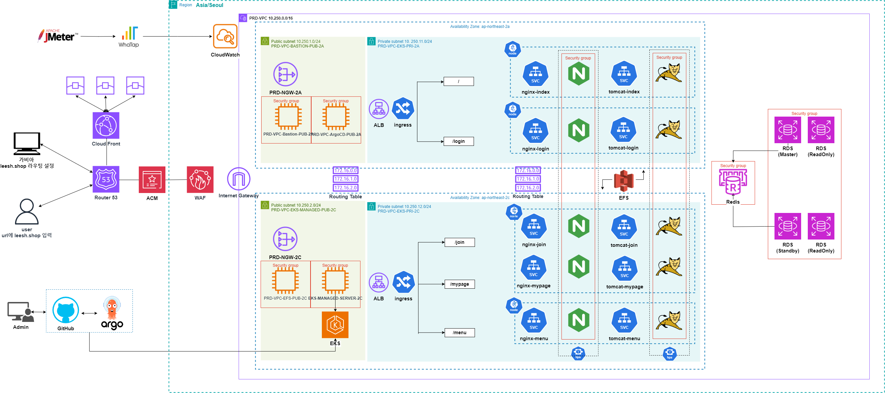
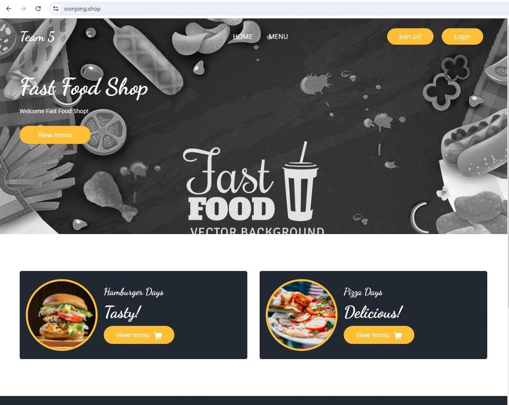
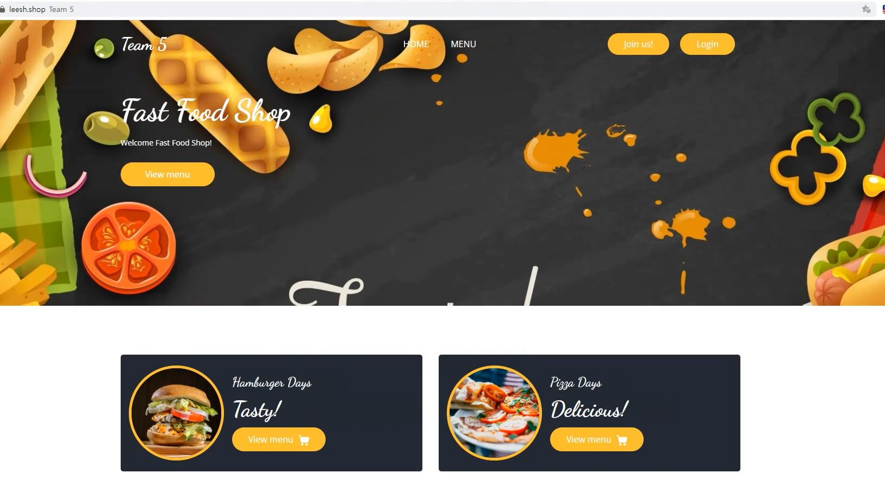
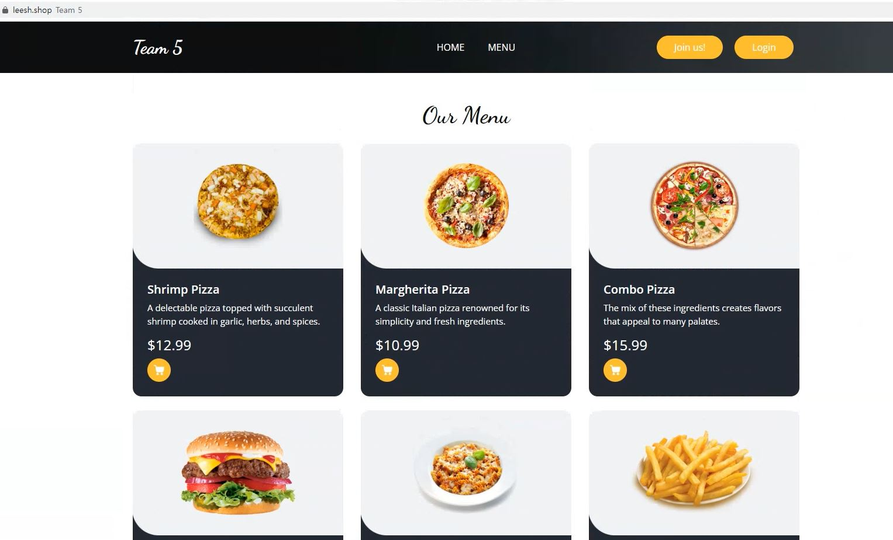
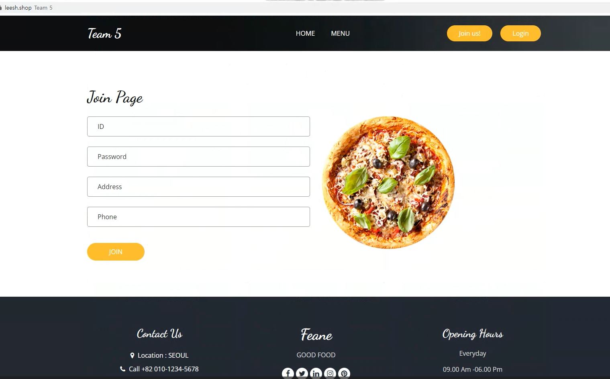
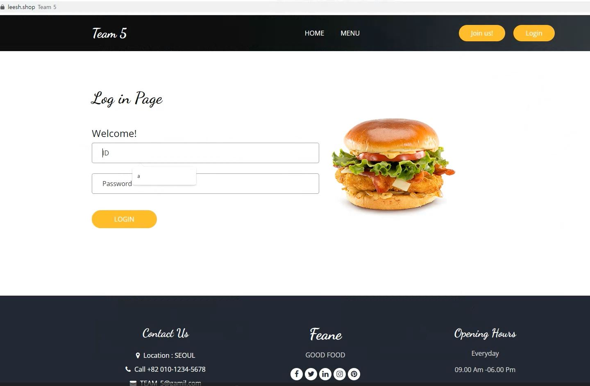

# Project2

## 📌 프로젝트 소개
AWS EKS 활용한 3-Tier 웹서비스 구축  

### 프로젝트 기획 배경
AWS EKS 를 활용하여 WEB, WAS, DB로 구성된 3-Tier 컨테이너 웹서비스 환경 구축 및 인프라 통신 구현
- 부하에 따라 자동으로 확장되는 시스템을 구성, JMeter 통해 Autoscaling 구현 및 검증
- Nginx와 Tomcat에 대한 HPA를 설정하여 부하에 따른 자동 확장을 구현

## 🧱아키텍처

## 🗂PAGE
--PAGE
 
  

